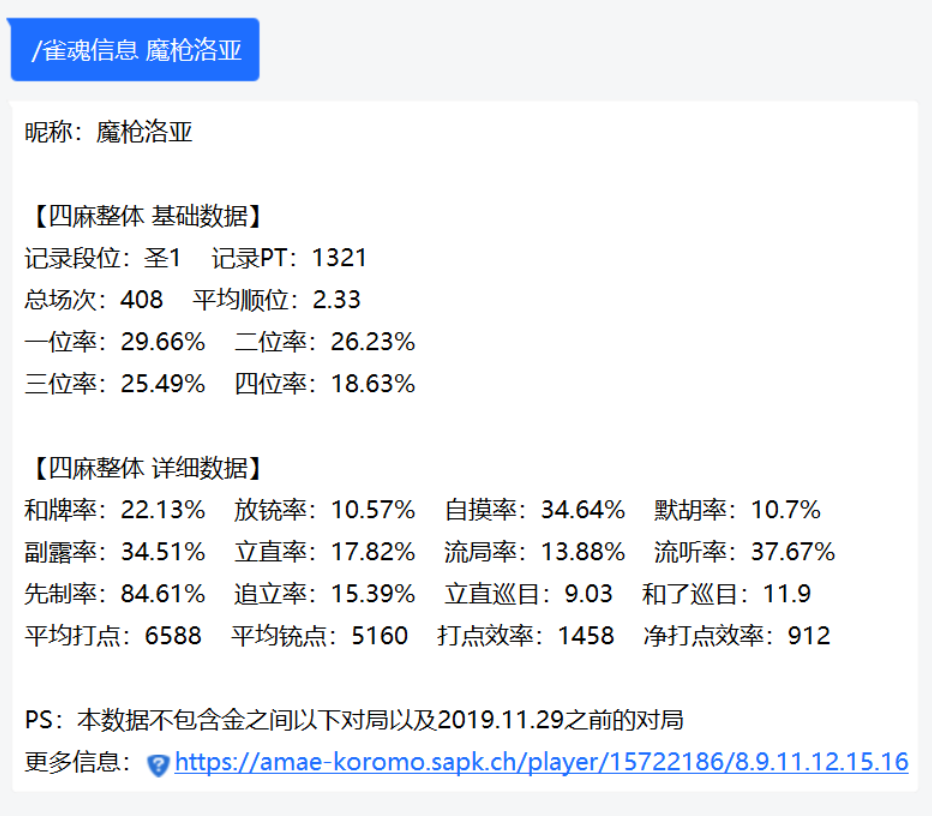
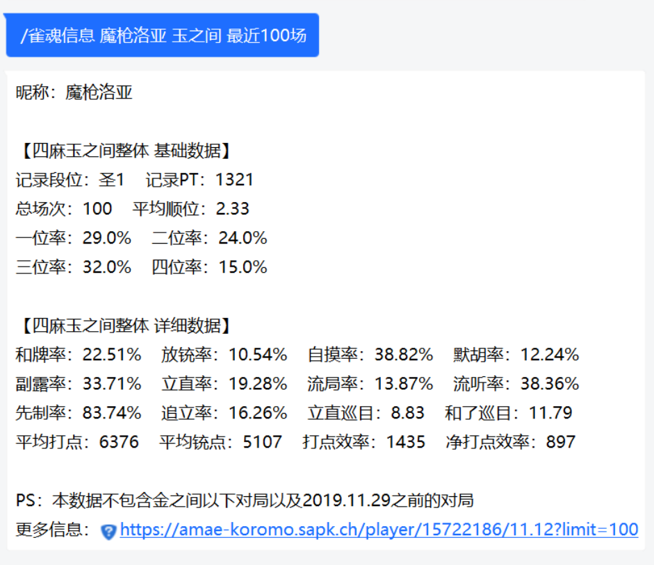
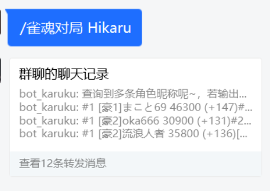
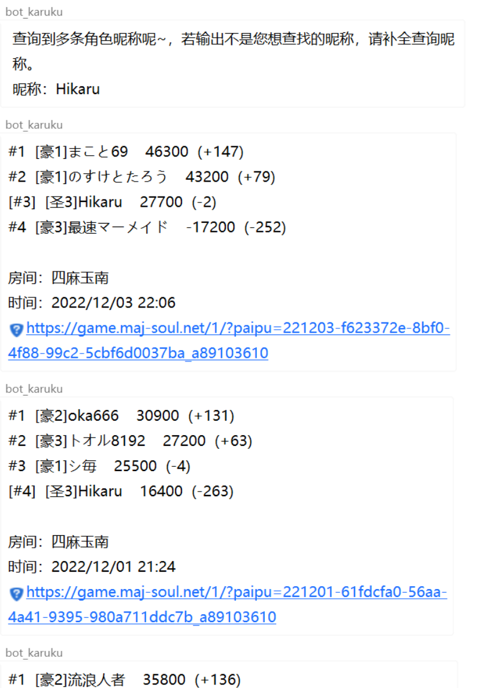
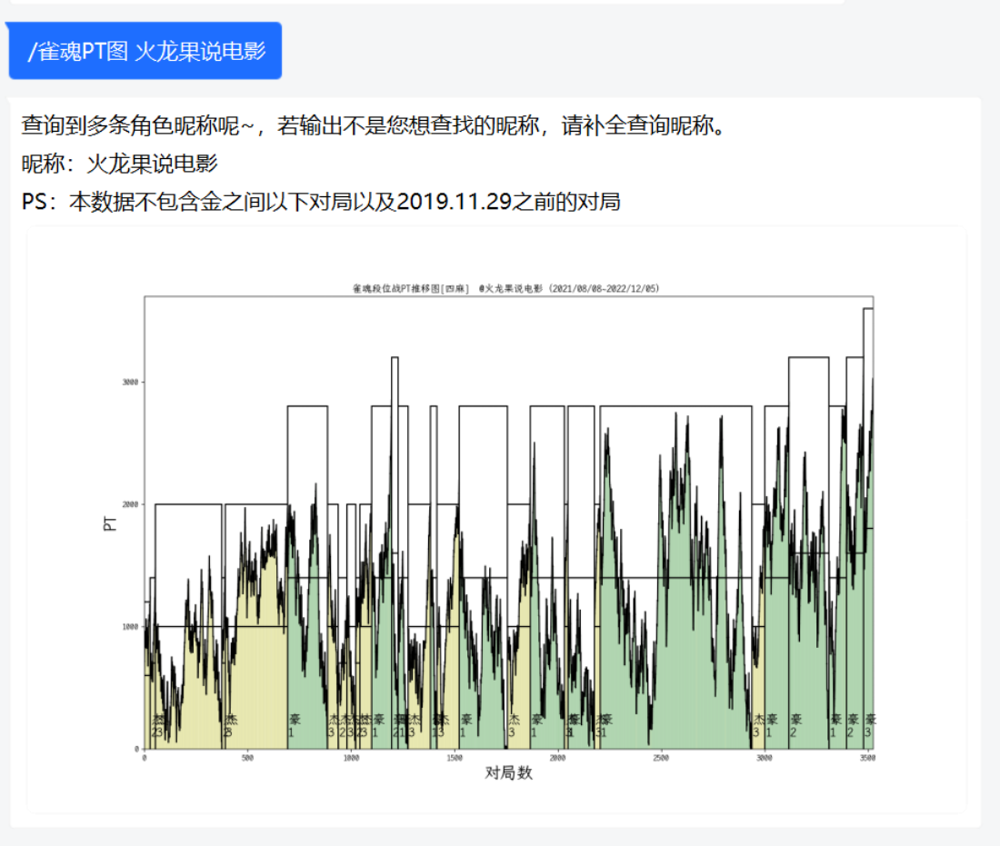
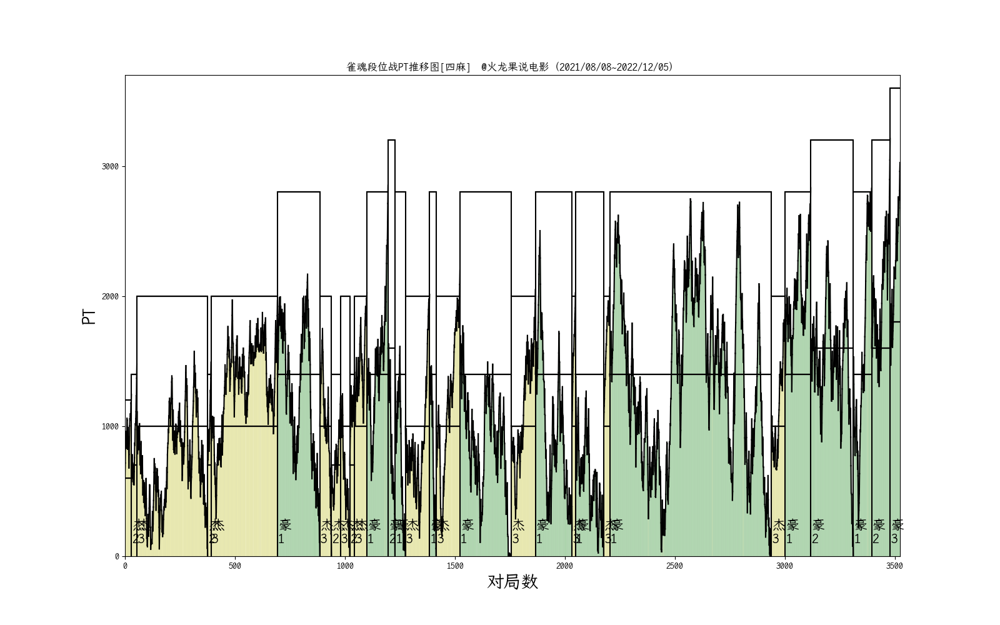

<!-- markdownlint-disable MD033 MD036 MD041 -->

<p align="center">
  <a href="https://v2.nonebot.dev/"></a>
</p>

<div align="center">

nonebot-plugin-majsoul
============

_✨ 雀魂信息查询插件 ✨_

</div>


<p align="center">
  <a href="https://raw.githubusercontent.com/ssttkkl/nonebot-plugin-majsoul/master/LICENSE">
    
  </a>
  <a href="https://pypi.python.org/pypi/nonebot-plugin-majsoul">
    
  </a>
  
</p>

受[DaiShengSheng/Majsoul_bot](https://github.com/DaiShengSheng/Majsoul_bot)启发而写的雀魂信息查询 Bot 插件。

支持适配器：Onebot V11

## 安装
python版本：3.8.13  
使用pip分别独立安装对应版本的依赖库  
```
nonebot2 = "^2.0.0b5"
nonebot-adapter-onebot = "^2.1.5"
tzlocal = "^4.2"
httpx = "^0.23.0"
pydantic = "^1.10.2"
monthdelta = "^0.9.1"
icmplib = "^3.0.3"
matplotlib = "^3.6.2"
typing-extensions = "^4.4.0"
```
使用git命令clone项目至本地`https://github.com/Ikaros-521/nonebot-plugin-majsoul.git`  
然后仅拷贝`nonebot-plugin-majsoul/src/nonebot_plugin_majsoul`文件夹至python安装路径下的`\Lib\site-packages\`目录下。  
打开 nonebot2 项目的 ```bot.py``` 文件, 在其中写入  
```nonebot.load_plugin('nonebot_plugin_majsoul')```  
当然，如果是默认nb-cli创建的nonebot2的话，在bot路径```pyproject.toml```的```[tool.nonebot]```的```plugins```中添加```nonebot_plugin_majsoul```即可  
pyproject.toml配置例如：  
``` 
[tool.nonebot]
plugin_dirs = ["src/plugins"]
plugins = ["nonebot_plugin_majsoul"]
``` 


## 功能

### 雀魂牌谱屋

#### 查询个人数据（可按照时间、按照场数、按照房间类型查询）

指令：`/雀魂(三麻)信息 <雀魂账号> [<房间类型>] [最近<数量>场] [最近<数量>{天|周|个月|年}]`





#### 查询个人最近对局（可按照房间类型查询）

指令：`/雀魂(三麻)对局 <雀魂账号> [<房间类型>]`





#### 绘制个人PT推移图

指令：`/雀魂(三麻)PT图 <雀魂账号> [最近<数量>场] [最近<数量>{天|周|个月|年}]`





## See Also

- [nonebot-plugin-mahjong-utils](https://github.com/ssttkkl/nonebot-plugin-mahjong-utils)：日麻小工具插件。支持手牌分析、番符点数查询。
- [nonebot-plugin-mahjong-scoreboard](https://github.com/ssttkkl/nonebot-plugin-mahjong-scoreboard)
  ：日麻计分器。为面麻群友提供日麻对局分数记录。根据马点进行PT精算，统计PT增减，支持对局与榜单查询与导出。

## LICENSE

AGPLv3
